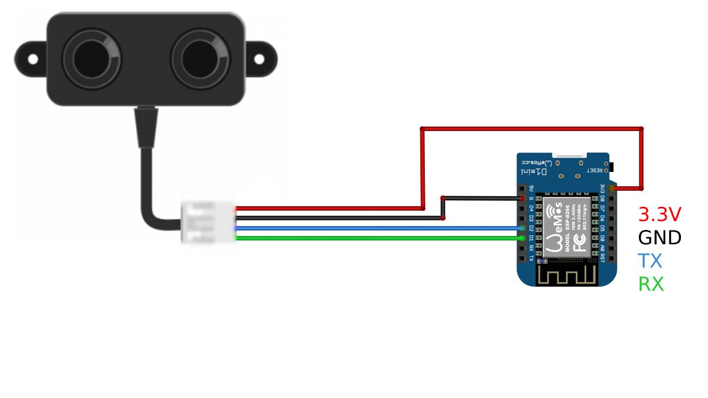
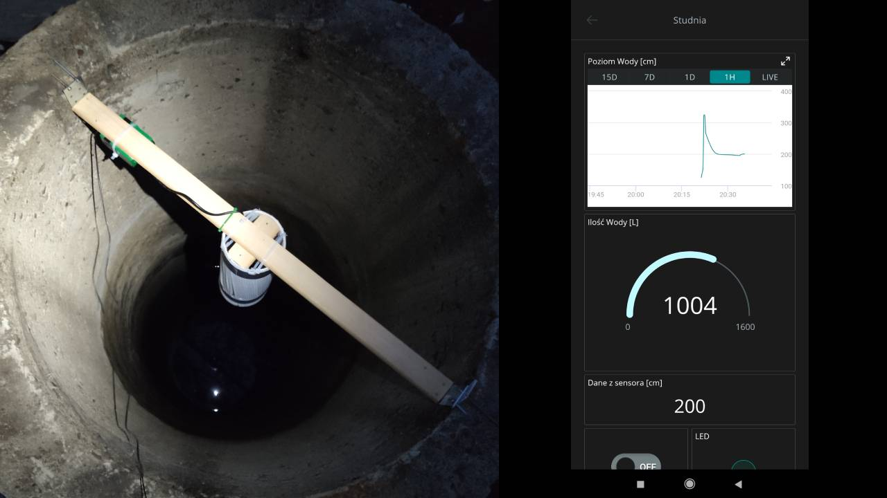

**Author** [mszjakub](https://github.com/mszjakub)

**Email** mszjakub.dev@gmail.com

**Date** 15/05/2023

**License** Public Domain

# Project: Water Well Observatory

The key idea of this project is to measure and monitor liquid level in concrete pipe (water well) and provide proper data in accessible form. For my curiosity.

Materials you need for this project.

| ID  |         Part name          |                                      Part number                                      | Quantity |
| :-- | :------------------------: | :-----------------------------------------------------------------------------------: | -------: |
| S1  | Ultrasonic distance sensor | [A02YYUW](https://wiki.dfrobot.com/_A02YYUW_Waterproof_Ultrasonic_Sensor_SKU_SEN0311) |        1 |
| A1  | ESP8266 development board  |            [Wemos D1 Mini](https://www.wemos.cc/en/latest/d1/d1_mini.html)            |        1 |
| P1  |        Power Supply        |                                                                                       |        1 |

## Step 1: Assemble the circuit

To connect A02YYUW to Wemos D1 Mini board, D1/D2 digital pins can be used as RX/TX.
Assemble the circuit following the diagram layout.jpg attached to this sketch.



```
// Defined pins used by A02YYUW ultrasonic sensor
#define rxPin D1 //green
#define txPin D2 //blue

SoftwareSerial Sensor (rxPin, txPin);
```

## Step 2: Installation

Set up [Arduino IoT Cloud](https://create.arduino.cc/iot/) to send data between an ESP8266 development board and the Arduino Cloud IoT.

-   Add and set up your **Device** as _3rd Party device_
-   Create new **Thing**
    -   Associate Device
    -   Add Cloud variables
-   Add your network credentials in the network section (_network name_, _network password_ and _secret key_)
-   Program the board
    -   go to the "Sketch" tab
    -   use [WaterWell.ino](./WaterWell.ino) code
    -   edit sketch as you like
    -   upload the code on to your board
-   Create your own Dashboard
    -   Add widgets (_Gauge_, _Chart_ or _Value_)
    -   Link variables

Here's a [more detailed tutorial](https://docs.arduino.cc/arduino-cloud/getting-started/esp-32-cloud) if needed.

## Folder structure

```
WaterWell_mszjakub => Arduino sketch folder

├── WaterWell.ino => main Arduino file
├── thingProperties.h => Code generated by Arduino IoT Cloud
├── arduino_secrets.h => holds your network data
├── sketch.json
├── layout.jpg => (optional) an image of the layout
└── README.md => this file
```

# Fieldwork

My Water Well is made of 5 concrete rings, 800mm wide and 800mm high each. Ultrasonic distance sensor was placed on top of it, under its cover.

> :warning: Because of probe sensing angle 60° it was necessary to build a simple waveguide to block any echoes that aren't perpendicular to the sensor. I find [this article](https://www.apgsensors.com/about-us/blog/how-to-make-a-standpipe-and-wave-guide-for-your-ultrasonic-sensor) helpful.

> _Tip: I wrapped the pvc pipe with bandages for better wave absorption._



To adjust this code for different water well dimensions, replace values with yours in `calculateVolume` function.

```
calculateVolume(calculatedDistance, <depth>, <radius>);
```
